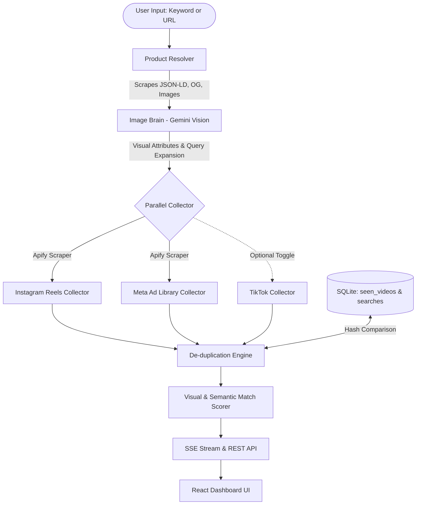

# 🎥 VidLens — Product Video Discovery Dashboard

> **Full-Stack AI Automation & Video Discovery Dashboard**  
> Built with Node.js (Express), React (Vite), SQLite, Apify Scrapers, and Google Gemini Vision AI.

---

## 📌 Executive Overview

VidLens is an intelligent video discovery pipeline that accepts a **product keyword** or **live e-commerce URL** (Shopify, Amazon, DTC brand site) and discovers at least **40 relevant short-form videos**:

A **product photo upload** is supported as a third input (JPEG/PNG/WebP, downscaled to 800px in the browser). With a photo alone, the Image Brain identifies the product and titles the search; a photo plus text uses the text as the title.
- **20 Instagram Reels**
- **20 Meta Ad Library Video Ads**
- *(Optional bonus: TikTok Videos behind toggle)*

An integrated **AI Image Brain** extracts deep visual attributes (colors, logos, materials, graphics, silhouettes) from product photography to generate tailored social search queries, filters out noise, and scores every video from **0 to 100** with human-readable AI explanations.

---

## 🏛️ System Architecture



---

## 💻 Tech Stack & Justifications

| Layer | Technology | Justification |
|---|---|---|
| **Backend** | **Node.js + Express** | Lightweight, high-throughput asynchronous I/O, native support for Server-Sent Events (SSE) streaming. |
| **Frontend** | **React 18 + Vite** | Sub-second HMR, modular UI components, high performance, and responsive styling without bloat. |
| **Database** | **SQLite (via `better-sqlite3`)** | Zero configuration, ACID-compliant file database with WAL journal mode; ideal for local deployments and fast deduplication indexing. |
| **Scraping** | **Apify Scrapers** | Managed scraper actors for Instagram Reels (`apify/instagram-hashtag-scraper`) and Meta Ads Library (`apify/facebook-ads-scraper`) that handle anti-bot protections, rate limits, and login walls. |
| **AI Vision Brain** | **Google Gemini Flash / Flash-Lite (vision)** | Generates multimodal structured JSON directly from product imagery and text, extracting precise visual facets and hashtags, then scoring every video's thumbnail + caption in batches. Includes automatic heuristic fallback. Model is configurable via `GEMINI_MODEL`. |
| **Styling** | **Vanilla CSS (Design Tokens)** | High-aesthetic deep space theme with glassmorphism, micro-animations, accessible contrast, and zero external framework lock-in. |

---

## 🚀 Quick Start Guide

### 1. Prerequisites
- Node.js (v18 or higher)
- npm (v9 or higher)

### 2. Clone and Setup Environment
```bash
git clone <your-repo-link>
cd "wishluck assignment"
```

Configure backend environment variables:
```bash
cp backend/.env.example backend/.env
```

Edit `backend/.env` with your API keys:
```env
PORT=3001
NODE_ENV=development
APIFY_API_TOKEN=your_apify_token_here
GEMINI_API_KEY=your_gemini_api_key_here
ENABLE_TIKTOK=false
```
*(Note: `APIFY_API_TOKEN` is required to collect videos — without it, no videos are returned. If `GEMINI_API_KEY` is omitted, product analysis and scoring fall back to text heuristics.)*

**Free-tier budgets** (both are enough to evaluate the app):
- **Apify** free plan: $5/month. One search costs roughly $0.35–0.40 (≈60 reels ≈ $0.10–0.15, Meta ad search ≈ $0.26), so about 12–14 searches per month.
- **Gemini** free tier: daily request limits are per model, so `GEMINI_MODEL` takes a comma-separated fallback chain (default `gemini-flash-lite-latest,gemini-3.1-flash-lite-preview,gemini-3-flash-preview`). One search uses about 4–6 requests.

### 3. Install Dependencies
```bash
# Backend dependencies
cd backend
npm install

# Frontend dependencies
cd ../frontend
npm install
cd ..
```

### 4. (Optional) Load Recorded Searches
No Apify credit? Load the five recorded live searches into your local database to explore the dashboard:
```bash
cd backend
npm run seed:demo
```
They appear in **Search History** with a `(recorded 7 Oct 2026)` suffix. Note: Instagram thumbnail URLs are signed and expire after a few days, so recorded reel thumbnails may stop loading; the reel links keep working.

### 5. Run the Application
**Terminal 1 — Backend Server:**
```bash
cd backend
npm run dev
# Backend starts at http://localhost:3001
```

**Terminal 2 — Frontend Dev Server:**
```bash
cd frontend
npm run dev
# Frontend starts at http://localhost:5173
```

Open **`http://localhost:5173`** in your browser.

---

## ☁️ Deploy to Render (free)

The repo includes a [`render.yaml`](render.yaml) Blueprint: one web service that builds the React UI and serves it from the Express API.

1. Sign in at [render.com](https://render.com) with GitHub.
2. **New → Blueprint**, pick this repository, click **Apply**.
3. When asked, paste `APIFY_API_TOKEN` and `GEMINI_API_KEY`.
4. Wait for the build (~3–5 min); the app is served at `https://vidlens-xxxx.onrender.com`.

Keys can be changed later under the service's **Environment** tab (save → the service restarts). The free plan has no persistent disk, so the SQLite database resets on restart; the recorded demo searches are loaded automatically on an empty database (set `SEED_DEMO=false` to disable). Free services sleep after inactivity, so the first request can take ~1 minute.

### Alternative: frontend and backend hosted separately
1. **Backend first** (Render → New → Web Service): root directory `backend`, build `npm install`, start `node src/server.js`, env vars `APIFY_API_TOKEN`, `GEMINI_API_KEY`, `NODE_ENV=production`. Note its URL, e.g. `https://vidlens-api.onrender.com`.
2. **Frontend** (Vercel/Netlify): root directory `frontend`, build `npm run build`, output `dist`, env var `VITE_API_BASE=https://vidlens-api.onrender.com/api`.
3. Back on the backend, set `FRONTEND_URL=https://your-frontend.vercel.app` so CORS allows it, and redeploy.

---

## 🐳 Docker Deployment (One-Command Run)

Run the full stack containerized with Docker Compose:

```bash
docker compose up --build
```
The server will boot on port `3001` with built production assets.

---

## 🔍 Video Sourcing Breakdown

### 1. Instagram Reels
- **Method**: Apify actor `apify/instagram-hashtag-scraper` with `resultsType: 'reels'`, run once with up to 6 hashtags derived by the Image Brain.
- **Query Strategy**: Image Brain hashtags (`#oversizedtee`), brand + product type, color + product type, sanitized to valid hashtag characters.
- **Handling Rate Limits & Login Walls**: Delegated to Apify's proxy pools. On the Apify free plan the actor returns one page (~30 posts) per hashtag, which is why several hashtags are searched per run.
- **Shortfall Mitigation**: If fewer than 20 unique items are returned, the engine retries with broader category-level queries. Any remaining deficit is flagged in the UI banner — results are never padded with placeholder videos.

### 2. Meta Ad Library
- **Method**: Apify actor `apify/facebook-ads-scraper` with Ad Library search URLs (`media_type=video`, all countries). Primary keywords use exact-phrase search; broadened keywords use any-word search.
- **Filtering**: Keeps only ads with a video creative (`snapshot.videos` or a video card); static image ads are dropped. Dynamic-product-ad templates like `{{product.brand}}` are skipped when picking the caption.
- **Shortfall Mitigation**: Same as Instagram — broader category keywords, then an honest deficit banner.

### 3. TikTok (Optional Bonus)
- Behind the `ENABLE_TIKTOK=true` environment variable and UI tab so it never blocks required platforms.

---

## 🧠 Image-Analysis Brain

The Image Brain ensures returned videos showcase the **exact product** rather than superficial keywords.

```
Product URL / Image ──► Gemini Flash Vision ──► Visual Attributes:
                                                    ├─ Product Type (e.g. "Oversized Heavyweight Tee")
                                                    ├─ Colors (e.g. "Washed Charcoal", "Off-White")
                                                    ├─ Patterns & Prints (e.g. "Distressed Back Graphic")
                                                    ├─ Material (e.g. "280 GSM Cotton French Terry")
                                                    └─ Shape & Distinct Features
```

### Scoring (0 - 100 Scale)
Up to 48 candidates per platform are scored by Gemini in batches of 24 (one multimodal call per batch). Each call receives the extracted product attributes, the reference product photo (for URL input), and every video's **thumbnail + caption**. Gemini returns a score and a one-line reason per video using this rubric:

| Score | Meaning |
|---|---|
| 80 – 100 | Clearly features this exact product or a near-identical one |
| 50 – 79 | Same kind of product, with differences (color, style, brand) |
| 20 – 49 | Loosely related (in passing, accessory, adjacent category) |
| 0 – 19 | Unrelated (e.g. ads for novels or other product categories) |

Judging the thumbnail and caption together handles captions in any language and catches creatives that only mention a keyword.

**Fallback** (no Gemini key, or a batch fails after retries): caption attribute match (60%) + search-query token overlap (40%). Fallback reasons start with "Keyword match"; AI reasons start with "AI:".

- **Threshold**: Videos scoring `< 40%` are flagged with a `"Low Match"` badge and dimmed in the UI.
- **Transparency**: Every video card displays the exact reason for its match score (e.g., *"AI: Black oversized cotton tee with graphic print, dropped shoulders, and boxy fit."*).

---

## 🛡️ De-Duplication Engine

To ensure each search provides unique, unseen videos:

1. **SHA-256 URL Hashing**: Media URLs and permalinks are hashed and indexed in SQLite (`seen_videos` table).
2. **Platform ID Normalization**: Reels shortcodes (`/reel/C8x.../`) and Meta Ad Archive IDs (`?id=10283...`) are tracked to prevent repost duplicates.
3. **Near-Duplicate Detection**: Detects re-uploads from the same creator or agency by generating an MD5 fingerprint of normalized caption text (stop words removed, punctuation stripped) combined with author handle.
4. **Cross-Search Filtering**: Videos already returned by an earlier search are split off before scoring. They are stored with the new search but flagged `is_previously_seen`, hidden by default, and shown with a "Seen before" badge when the user turns on **"Show previously seen"**. They reuse the score from their earlier search (no extra AI calls) and do not count toward the 20-video minimum.
5. **Refill After De-duplication**: Collectors count only unseen videos toward the minimum. If a source is short, they run broader category queries, then page deeper into the primary hashtags/keywords (30 reels per hashtag, 40 ads per query). Any remaining deficit is shown in the progress log and a banner rather than padded.

---

## 🧪 Test Evidence: Live Runs (7 Oct 2026, 5 products)

Five products were searched live against Apify + Gemini. **Collected** = unique videos kept after de-duplication (up to 48 per platform are scored). **Relevant** = AI match score ≥ 40. The full results of all five runs are in [`backend/demo/recorded-searches.json`](backend/demo/recorded-searches.json) and can be loaded into the dashboard with `npm run seed:demo`.

| # | Product Input | Type | Instagram (collected / relevant) | Meta Ads (collected / relevant) | Score Range | Good Match | Low Match (correctly ranked down) |
|---|---|---|---|---|---|---|---|
| **1** | `oversized graphic tee` | Keyword | 48 / 24 | 38 / 22 | 0 – 95 | [Reel](https://www.instagram.com/reel/DPtAOFEkTQB/) — *"Clearly features oversized, boxy graphic t-shirts with dropped shoulders"* (95) | [Ad](https://www.facebook.com/ads/library/?id=1669793474569805) — *"video focuses on mid-rise denim jeans"* (0) |
| **2** | `protein dark chocolate` | Keyword | 48 / 18 | 22 / 7 | 0 – 95 | [Ad](https://www.facebook.com/ads/library/?id=2063920524239154) — *"Clearly features and eating a protein chocolate bar"* (95) | [Reel](https://www.instagram.com/reel/DeFNLF9NvuN/) — *"chicken and chips meal; unrelated to protein bars"* (10) |
| **3** | `https://www.gymshark.com/products/gymshark-crest-hoodie-black-ss22` | URL | 48 / 2 | 21 / 1 | 0 – 90 | [Reel](https://www.instagram.com/reel/Dd9NHYnKGsL/) — *"Clearly features the Gymshark black crest hoodie"* (90) | [Reel](https://www.instagram.com/reel/DeF6991TzDC/) — *"Unrelated motorcycle video"* (0) |
| **4** | `minimalist leather backpack` | Keyword | 48 / 14 | 24 / 6 | 0 – 90 | [Ad](https://www.facebook.com/ads/library/?id=1403422461913852) — *"minimalist leather rolltop backpack"* (90) | [Reel](https://www.instagram.com/reel/DdEIwHPpgb1/) — *"Action thriller show trailer, unrelated"* (0) |
| **5** | `wireless noise canceling headphones` | Keyword | 40 / 9 | 45 / 18 | 0 – 95 | [Ad](https://www.facebook.com/ads/library/?id=1096246696177280) — *"Sony wireless noise canceling over-ear headphones clearly worn"* (95) | [Reel](https://www.instagram.com/reel/CoaXup7Ik56/) — *"Podcast promotion about cancel culture, unrelated"* (0) |

**Observations**
- Every search met the 20-video collection target on both platforms; relevance depends on how much content exists for the product.
- Broad products (tees, protein bars) yield many relevant videos. A single exact SKU (Gymshark Crest Hoodie) has few creator videos, so most collected videos are correctly scored low rather than inflated.
- Captions in other languages (e.g. Spanish, Indonesian) were scored correctly because the AI judges thumbnail + caption, not keyword overlap.
- Run 5 was made on the deployed Render instance. 16 of its 40 reels were scored by the keyword fallback because one Gemini batch failed on the free tier; those are labelled "Keyword match" in the UI rather than "AI verdict".

---

## 📋 Running Automated Tests

Run the built-in Node test suite:

```bash
cd backend
npm test
```

**Test Coverage:**
- `deduplication.test.js`: URL dedup, platform ID dedup, near-duplicate detection, author fingerprinting, deficit calculation.
- `scoring.test.js`: Attribute match scoring, brand scoring, empty caption resilience, threshold tagging.

---

## 🌟 Bonus Features Included

- ✅ **Bookmark & Shortlist Collection**: Users can bookmark candidate videos directly on the card and filter by shortlist.
- ✅ **CSV Export**: Export all discovered videos, URLs, creators, and AI match reasons with one click.
- ✅ **Dockerized One-Command Run**: Multi-stage `Dockerfile` + `docker-compose.yml`.
- ✅ **SSRF Protection**: `urlValidator.js` blocks internal hostnames and private subnet ranges.
- ✅ **Real-Time SSE Feedback**: Live step-by-step progress tracker during the pipeline execution.

---

## ⚠️ Known Limitations & Future Roadmap

1. **Platform Rate Limits**: Scraping without residential proxies may encounter temporary throttling from Meta or Instagram. *Solution in place: Apify proxy management, query broadening, and an explicit shortfall banner.*
2. **Instagram thumbnails expire**: Instagram CDN thumbnail URLs are signed and stop loading after some time, so older searches in history may show broken thumbnails. The reel links keep working.
3. **Scoring sees the thumbnail, not the full video**: a product shown only later in a video can be under-scored.
4. **Video Playback CORS**: Instagram and Meta restrict iframe embeds for private or ad-archive videos. *Solution in place: Direct link-out cards with preview thumbnails.*
5. **Future Roadmap**:
   - Webhook integration for asynchronous batch exports.
   - Vector database (e.g. Chroma / Qdrant) for CLIP image embeddings.
